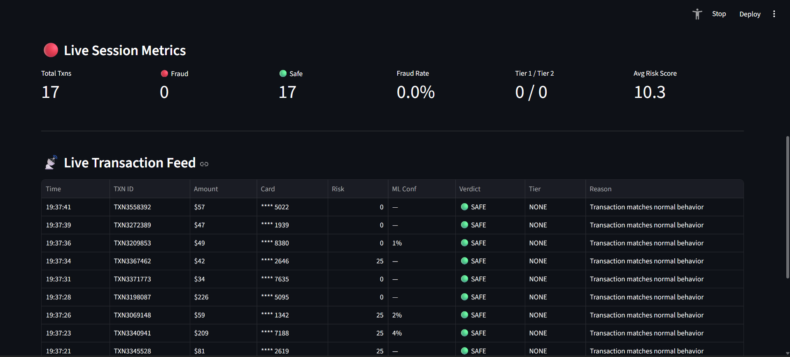
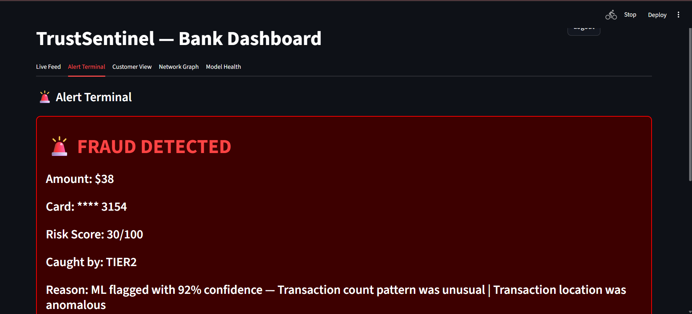
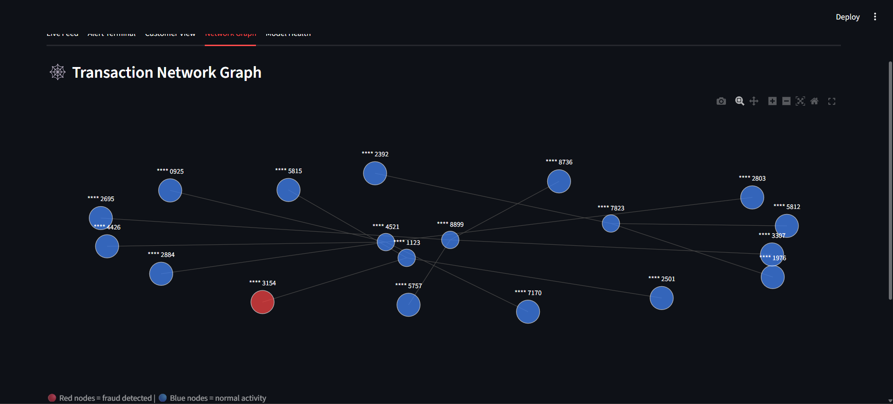
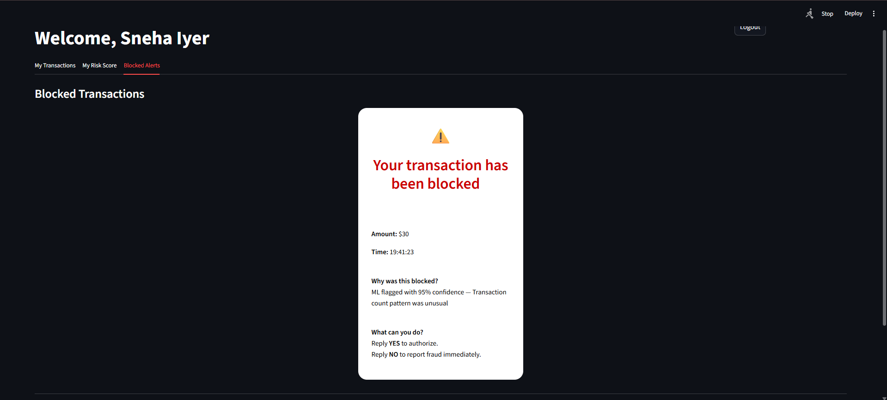

# TrustSentinel

Real-time UPI fraud detection engine with per-card behavioral profiling and explainable AI.

Built for Datathon 2026 by Team PARADIGM.

---
## Live Links

- Live Demo: https://trustsentinel-paradigm.streamlit.app
- GitHub Repo: https://github.com/ruushhdaa/TrustSentinel
- Prototype Screenshots: Available in this repository under assets/

---

## Problem Statement

Fraud detection in UPI / digital payments (PS-07)

---

## Core Idea

Most fraud detection systems compare every transaction against a global average. TrustSentinel takes a different approach — it builds a personal behavioral profile for every single card and asks:

"Is this transaction suspicious for THIS specific person?"

A 90,000 rupee transaction is an emergency for one person and completely normal for another. Our system knows the difference.

---

## Architecture

Two-Tier Hybrid Engine:

- Tier 1 — Rule Engine: Catches obvious attacks instantly (rapid-fire transactions, extreme amount spikes, suspicious timing) with zero ML overhead
- Tier 2 — ML Engine: Random Forest trained with SMOTE on balanced data catches sophisticated fraud patterns that rules cant detect

On top of that:
- SHAP generates plain English explanations for every fraud flag
- Per-card risk scoring based on individual behavioral deviation
- Model drift detection monitors when fraud patterns shift
- Adjustable threshold lets banks control precision vs recall tradeoff

---

## Model Performance

Evaluated on 118,000 unseen real transactions:

- AUC-ROC: 0.93
- AUC-PR: 0.72
- F1 Score: 0.68
- Precision: 81%
- Recall: 58.6%
- Frauds Caught: 2423 out of 4133

---

## Dashboard

Streamlit dashboard with role-based access:

Bank View:
- Live transaction feed with real-time metrics
- Alert terminal with fraud history
- Transaction network graph
- Model health monitoring with drift detection
- Adjustable fraud detection threshold

Customer View:
- Personal transaction history
- Risk score gauge
- Plain English explanation when a transaction is blocked
- Clear instructions on what to do next

---

## Dataset

- IEEE-CIS Fraud Detection (Kaggle)
- 590,000 real transactions from an actual company
- 13,553 unique card profiles built
- NOT synthetic data — real-world transaction patterns

---

## Tech Stack

- Language: Python
- ML: scikit-learn (Random Forest)
- Balancing: SMOTE (imbalanced-learn)
- Explainability: SHAP
- Dashboard: Streamlit + Plotly
- Graph Analysis: NetworkX
- Data: pandas, numpy

---

## Project Structure

- engine.py — Backend fraud detection engine
- app.py — Streamlit dashboard frontend
- requirements.txt — Python dependencies
- .gitignore — Files excluded from repo
- README.md — This file

---

## How to Run

1. Clone the repo
2. Run: pip install -r requirements.txt
3. Download IEEE-CIS dataset from Kaggle and place train_transaction.csv in the project folder
4. Run: streamlit run app.py

Login credentials:
- Bank: bank_admin / bank123
- Customer: priya / priya123 or arjun / arjun123 or sneha / sneha123

---

---

## Prototype Screenshots

### Live Feed - Bank View

### Alert Terminal - Bank View

### Network Graph - Bank View

### Block Alert - Customer View

---

## Team PARADIGM

- Manaswi Mishra
- Rushda Jagtap

Built for GirlScript Datathon 26'
